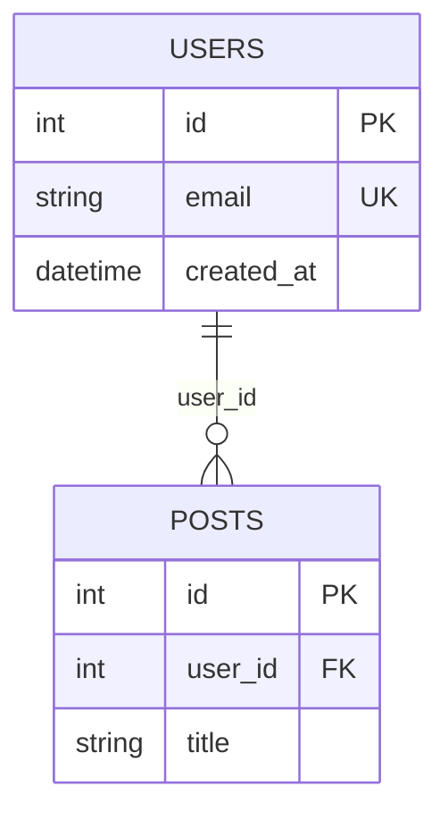

# schema-diagram-generator

Generates ER diagrams in Mermaid or PlantUML syntax from database schema XML files. Output is embedded in Markdown for easy documentation and version control.

## Usage

### CLI

```bash
cargo run -p schema-diagram-generator -- \
  --format mermaid \
  --schema-file schema.xml
```

**Arguments:**

- `--format` (required): `mermaid` or `plantuml` (case-insensitive)
- `--schema-file` (required): Path to XML schema file

**Output:**

Writes a Markdown file named `{schema-stem}-{format}.md` in the same directory as the input file. For example:
- Input: `schema/database.xml`
- Output: `schema/database-mermaid.md` (if format=mermaid)

The file contains diagram syntax ready to be embedded in documentation or README files.

### Output Examples

#### Mermaid Format



#### PlantUML Format

```plantuml
entity USERS {
    id : int <<PK>>
    email : string <<UK>>
    created_at : datetime
}

entity POSTS {
    id : int <<PK>>
    user_id : int <<FK>>
    title : string
}

USERS ||--o{ POSTS : user_id
```

## Features

- **Mermaid Diagrams**: Modern, Markdown-native syntax with cardinality annotations
- **PlantUML Diagrams**: More traditional ER diagram notation
- **Primary/Foreign Key Annotations**: Visual distinction for keys
- **Relationship Cardinality**: Automatically derived from relation definitions
- **Markdown Output**: Easy to commit to version control and embed in docs

## Part of schema-rs

See the [workspace README](../README.md) for an overview of the full schema-rs toolchain.
